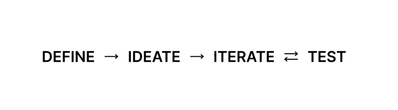
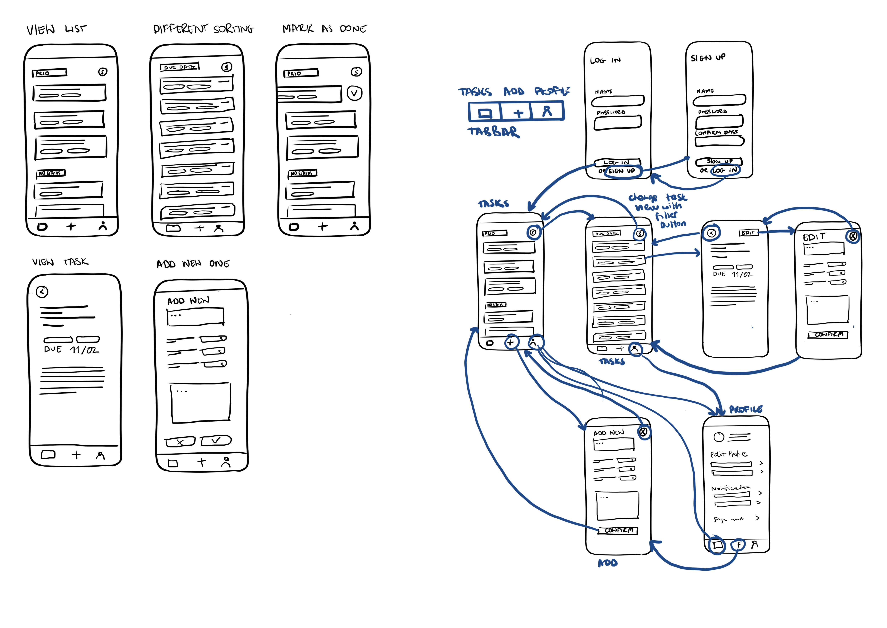

# Task Management Mobile App
### Case Study by Marta Pienkosz, [Final Prototype](https://www.figma.com/proto/PPEfUdjkdwkOGH76aLk0D6/Prototyping-App?page-id=0%3A1&node-id=1%3A2&starting-point-node-id=1%3A2)

## Design process
**Prompt**: Design a task management mobile app for college students.
**Approach**: I implemented my personal design process, outlined below.

### Define

I used brainstorming and mind maps, several ideation methods to define and find solutions to the problem. Ultimately, I noticed the need for a very simple application that would allow the user to see all the tasks and sort them by priority and due date, and also allow the user to add a longer task description. I decided to adhere to the simplicity and build a very intuitive first prototype that would fulfill this need.

### Ideate

After defining the application scopes, I sketched mockups and user flows. My goal was to visualize the MVP and showcase the main functionalities. I've decided that my app will have a tab bar with 3 different screens: Profile, Task List, and Add Task. I was hoping that including this popular UI element would make my application very intuitive and users would be able to add new tasks simply and quickly, without the need for extra onboarding. At this step, I also reached out to a desired audience, college students, for feedback.

### Iterate
After the ideation, I moved to Figma and started building my interactive prototype. At this point, I wasn't using colors or drawing user flows, instead I focused on recreating and refining my sketches for a virtual environment. This step involves decisions about selecting icons and appropriate button sizes.

### Test
I then tested my prototype with my desired audience by asking unbiased, open-ended questions. I learned that users would like to see confirmation messages after they have performed certain actions and have the ability to mark tasks as completed on the home screen. User testing also allowed me to identify UI elements that were not quite intuitive, such as the arrow that led to the "View Task" screen.

### Iterate & Test & Iterate
Eventually, I entered the final testing phase where I took into account the feedback I received, redesigned the app, and re-tested the prototype with users. At this stage, I refined the UI elements, added user flows and button states, such as distable states.

## Looking forward

**Learnings**: Through the design process of this app, I learned how to create and prototype ideas. I learned how to use Figma software and how to conduct user testing. I think the biggest challenge was deciding on the features of the first prototype and focusing only on the absolute minimum so that the MVP was understandable and professionally presented the main features of the product.

**Next steps**: If I were to continue working on this project, the next step would be to seek feedback from more users and to learn more about best practices regarding button sizes, safe areas and accessibility. In terms of functionality, I would like the task description option to support other types of files (PDF, images, links) so that users could, for example, add a link to an article that they are to read for classes or attach a photo of the whiteboard.